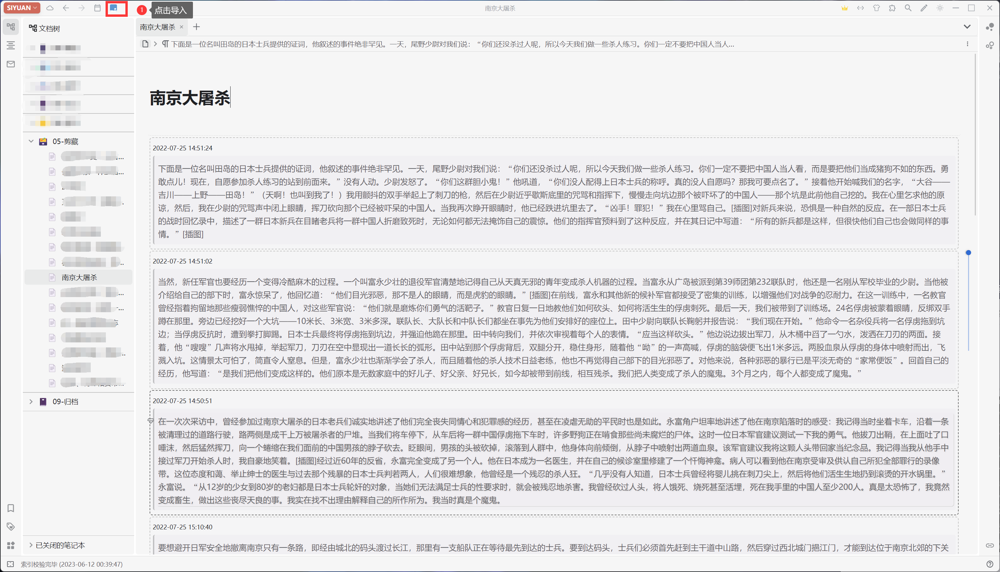
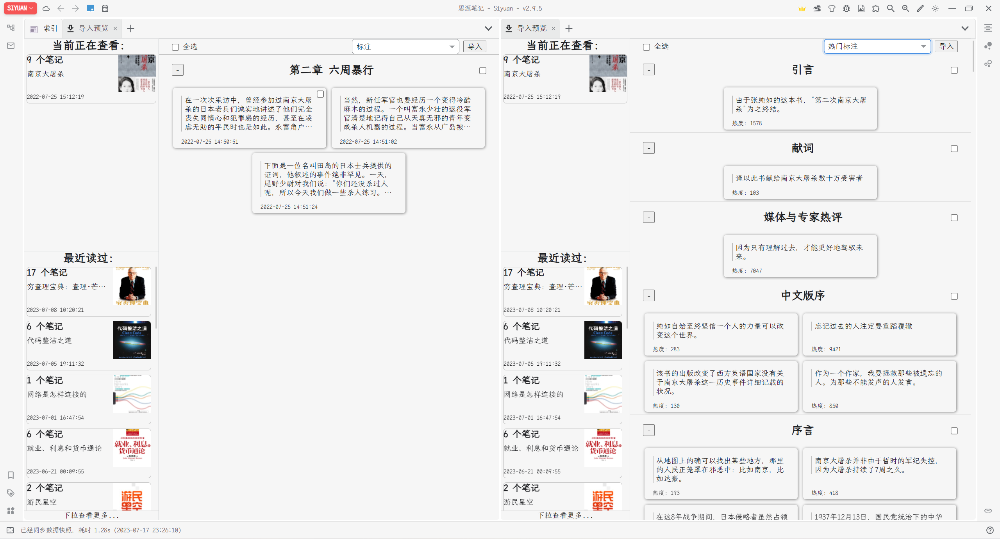
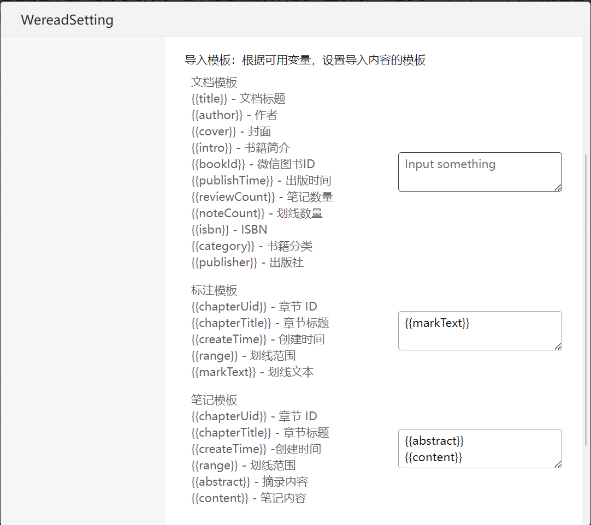

# Siyuan Weread Plugin

思源微信读书插件是一个社区插件，用户同步微信读书中的高亮标注、划线感想等，并将这些信息保存到思源指定笔记本目录下。

## 功能

- 导入书籍元数据，如：书籍封面、作者、出版社等
- 同步微信读书高亮划线
- 同步微信读书笔记
- 支持微信扫码登录
- 支持自动刷新 Cookie（延长登录有效期）
- 自定义模板

## 设置

插件支持多种进入设置的方式：

1. 思源-设置-插件，选择微信读书插件的设置
2. 右键插件，点击设置按钮

## 使用

⚠️ 本插件是覆盖式更新，请不要在同步的文件里修改内容

### 导入全部笔记

点击微信读书按钮，会导入微信读书的所有标注和笔记

## 导入部分笔记

在插件的设置面板-导入预览，选择需要导入的书以后，点击“获取信息”按钮，选择需要导入的标注和笔记

## 设置模板

在插件的设置面板-常规设置，按可用变量设置模板后，可按模板导入微信读书笔记
